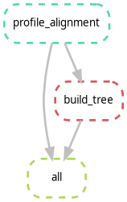

# DPS Main Pipeline

**Automated and reproducible workflow for merging structural and sequence alignments of Dps proteins and constructing a combined phylogenetic tree.**

Built with Snakemake and executed inside a Docker container — no manual steps, fully portable.

---

1. [Overview](#overview)
2. [Features](#features)
3. [Installation](#installation)
4. [Configuration](#configuration)
5. [Pipeline Steps](#pipeline-steps)
6. [Input Data Requirements](#input-data-requirements)
7. [Output Structure](#output-structure)
8. [DAG](#dag)
9. [Reproducibility](#reproducibility)
10. [Troubleshooting](#troubleshooting)
11. [References](#references)
12. [Contact](#contact)

---

## Overview

The DPS Main Pipeline provides a **reproducible and automated workflow for integrating structural and amino acid sequence alignments of Dps proteins into a single unified phylogenetic analysis**. It takes a pre-computed structural alignment already in FASTA format (e.g. produced by the DPS Structural Pipeline) and a standard amino acid FASTA alignment, merges them via profile-profile alignment, constructs a maximum-likelihood phylogenetic tree, and generates a sequence identity heatmap from the final alignment.

> The structural alignment is expected as a FASTA input. If you have a raw MODELLER `.ali` file, convert it first using the [DPS Structural Pipeline](https://github.com/filipaifernandes/dps_structural_pipeline).

Three steps are combined:
- **Profile-profile alignment** — merges a pre-computed structural alignment (FASTA) with an amino acid sequence alignment into a single unified alignment using Clustal Omega
- **Phylogenetic tree inference** — maximum-likelihood tree construction from the combined alignment using FastTree
- **Sequence identity heatmap** — pairwise sequence identity matrix computed from the final alignment, saved as a CSV and visualized as a heatmap (PNG)

> All steps run inside a Docker container for full reproducibility.

---

## Features

- **Profile-profile alignment** — Clustal Omega merges a pre-computed structural FASTA alignment with an amino acid alignment while preserving both signal sources
- **Phylogenetic tree** — maximum-likelihood inference with FastTree's LG model (Newick output)
- **Sequence identity heatmap** — pairwise identity matrix across all sequences in the final alignment, exported as CSV and PNG
- **Containerized** — all steps run inside an identical Docker environment
- **Config-driven** — swap file paths in `config.yaml` to reuse the pipeline on any protein dataset

---

## Installation

**Requirements:** Snakemake and Apptainer (or Docker)

```bash
# 1. Install Snakemake
conda install -c conda-forge -c bioconda snakemake

# 2. Install Apptainer (Ubuntu)
# Download apptainer_1.4.5_amd64.deb from https://github.com/apptainer/apptainer/releases/tag/v1.4.5
sudo apt install ./apptainer_1.4.5_amd64.deb

# 3. Clone the repo
git clone https://github.com/yourname/dps_main_pipeline.git
cd dps_main_pipeline

# 4. Run
snakemake --use-singularity --cores 4
```

The container image (`docker://filipafernandes/dps_main:002`) is pulled automatically.

---

## Configuration

All pipeline behaviour is controlled via `config.yaml`:

```yaml
# Input files
aa_alignment: "data/raw/aa.fasta"
structural_fasta: "data/raw/structural.fasta"

# Output files
final_alignment: "data/alignment/final_alignment.fasta"
tree: "data/tree/tree.nwk"
```

| Parameter | Description |
|---|---|
| `aa_alignment` | Amino acid multiple sequence alignment (FASTA) |
| `structural_fasta` | Structural alignment converted to FASTA (from step 1) |
| `final_alignment` | Output path for the merged profile alignment |
| `tree` | Output path for the phylogenetic tree (Newick) |

The heatmap outputs are written to `data/heatmap/` automatically and require no additional configuration.

To reuse the pipeline for a different protein, update the input file paths accordingly.

---

## Pipeline Steps

| Step | Tool | Execution | Output |
|---|---|---|---|
| Profile-profile alignment | Clustal Omega (`--p1`/`--p2`) | Container | `data/alignment/final_alignment.fasta` |
| Phylogenetic tree | FastTree (`-lg`) | Container | `data/tree/tree.nwk` |
| Sequence identity heatmap | Python (`seaborn`, `BioPython`) | Container | `data/heatmap/sequence_identity.csv`, `data/heatmap/sequence_identity.png` |

### Sequence Identity Heatmap

The `sequence_heatmap` rule computes pairwise sequence identity across all sequences in the final alignment. Gap positions are excluded from the identity calculation. Results are saved as:

- **`sequence_identity.csv`** — full pairwise identity matrix (rows and columns are sequence IDs)
- **`sequence_identity.png`** — heatmap visualization using a `viridis` color scale (0–1), 300 dpi

---

## Input Data Requirements

### Amino Acid Alignment (`aa_alignment`)
- **Format**: FASTA
- **Content**: Multiple sequence alignment of amino acid sequences

```
>protein_1
MKVLWAAЛЛVTFAGCAKAKEVVVIVGPNATGKVАЛGHIDNVLVPРETPD
>protein_2
MKVLWAAЛЛVTFAGCAKAKEVVVIVGPNATGKVАЛGHIDNVLVPРETPD
```

### Structural Alignment (`structural_fasta`)
- **Format**: FASTA
- **Content**: Structural alignment already converted to standard FASTA format
- This file is expected as a ready input — if you have a raw MODELLER `.ali` file, convert it first (e.g. using the DPS Structural Pipeline)

---

## Output Structure

```
data/
├── raw/
│   ├── aa.fasta                        # Input amino acid alignment
│   └── structural.fasta                # Converted structural alignment (FASTA)
├── alignment/
│   └── final_alignment.fasta           # Combined profile alignment
├── tree/
│   └── tree.nwk                        # Phylogenetic tree (Newick format)
└── heatmap/
    ├── sequence_identity.csv           # Pairwise identity matrix
    └── sequence_identity.png           # Heatmap visualization (300 dpi)
```

The tree can be visualized with [FigTree](http://tree.bio.ed.ac.uk/software/figtree/), [iTOL](https://itol.embl.de/), or any Newick-compatible viewer.

---

## DAG



Generate your own:
```bash
snakemake --dag | dot -Tpng > dag.png
```

---

## Reproducibility

- Snakemake tracks dependencies and only reruns changed rules
- The Docker container pins all tool versions (Clustal Omega, FastTree, Python 3.13)
- `config.yaml` makes the pipeline reusable for any alignment dataset
- The container image is versioned (`dps_main:002`) for exact reproducibility

---

## Troubleshooting

**Clustal Omega errors**
→ Verify the FASTA format of `structural.fasta` — check for invalid characters or non-standard amino acid codes

**FastTree warnings about low confidence**
→ Small alignments may produce low bootstrap values; ensure `final_alignment.fasta` contains more than 2 sequences

**Heatmap errors (`ValueError: sequences are not properly aligned`)**
→ The heatmap script requires all sequences to have the same length; verify that `final_alignment.fasta` is a proper multiple sequence alignment

**File not found errors**
→ Double-check paths in `config.yaml` match your actual file locations; use absolute paths if relative paths cause issues

For verbose output: `snakemake --use-singularity --cores 4 -v`

---

## References

- **Snakemake** — Mölder et al., *F1000Research* 2021
- **Clustal Omega** — Sievers & Higgins, *Multiple Sequence Alignment Methods* 2018
- **FastTree** — Price et al., *PLoS ONE* 2010

---

## Contact

**Filipa Fernandes** — Bioinformatics Student
[filipaifernandes.2005@gmail.com](mailto:filipaifernandes.2005@gmail.com)
